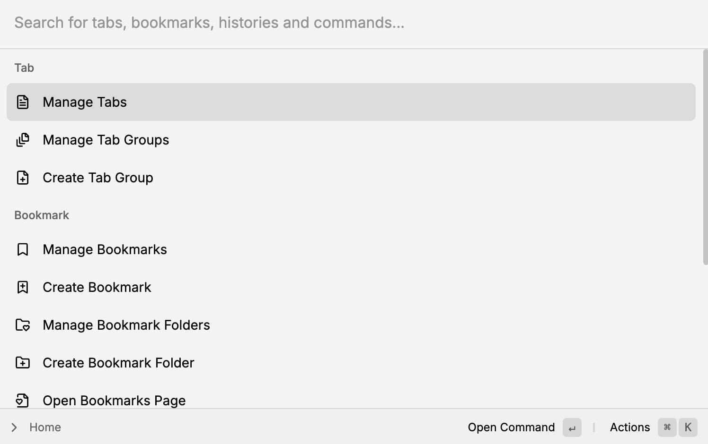

# QuickCast

**Quick Cast** is a Chrome extension that allows you to quickly control your tabs, bookmarks and histories.
Inspired by [Raycast](https://www.raycast.com/), a productivity tool for macOS, I tried to make a similar tool for
Chrome.

After installing the extension, you can open the extension's popup by pressing:

- `Ctrl+Shift+P` on Windows
- `Cmd+Shift+P` on macOS.

Then you can type commands to control your tabs, bookmarks and histories.

## Features

Once you open the popup, you can select a command:

| Section        | Command                 | Available actions                         | Action shortcut         |
| -------------- | ----------------------- | ----------------------------------------- | ----------------------- |
| **Tab**        | Manage Tabs             | Switch to a tab                           | `Enter`                 |
|                |                         | Toggle bookmark                           | `Ctrl(Cmd) + B`         |
|                |                         | Toggle pin                                | ``Ctrl(Cmd) + ` ``      |
|                |                         | (Reorder) Move tab up                     | `Ctrl(Cmd) + Shift + ↑` |
|                |                         | (Reorder) Move tab down                   | `Ctrl(Cmd) + Shift + ↓` |
|                |                         | (Reorder) Move tab top                    | `Ctrl(Cmd) + Shift + ←` |
|                |                         | (Reorder) Move tab bottom                 | `Ctrl(Cmd) + Shift + →` |
|                |                         | Move to a tab group                       | `Ctrl(Cmd) + G`         |
|                |                         | Close a tab                               | `Ctrl(Cmd) + D`         |
|                |                         | Create a new tab                          | `Ctrl(Cmd) + T`         |
|                | Manage Tab Groups       | Toggle collapse                           | `Enter`                 |
|                |                         | Close a tab group                         | `Ctrl(Cmd) + D`         |
|                |                         | Edit group name                           | `Ctrl(Cmd) + E`         |
|                |                         | Ungroup tabs from a group                 | `Ctrl(Cmd) + R`         |
|                |                         | Create a new tab group                    | `Ctrl(Cmd) + G`         |
| **Bookmark**   | Manage Bookmarks        | Open a bookmark                           | `Enter`                 |
|                |                         | Open a bookmark in a tab group            | `Ctrl(Cmd) + Enter`     |
|                |                         | Create a new bookmark                     | `Ctrl(Cmd) + B`         |
|                |                         | Edit a bookmark                           | `Ctrl(Cmd) + E`         |
|                |                         | Delete a bookmark                         | `Ctrl(Cmd) + D`         |
|                |                         | Move to a bookmark folder                 | `Ctrl(Cmd) + M`         |
|                |                         | (Reorder) Move bookmark up                | `Ctrl(Cmd) + Shift + ↑` |
|                |                         | (Reorder) Move bookmark down              | `Ctrl(Cmd) + Shift + ↓` |
|                |                         | (Reorder) Move bookmark top               | `Ctrl(Cmd) + Shift + ←` |
|                |                         | (Reorder) Move bookmark bottom            | `Ctrl(Cmd) + Shift + →` |
|                | Manage Bookmark Folders | Open a bookmark folder                    | `Enter`                 |
|                |                         | Open a bookmark folder in a tab group     | `Ctrl(Cmd) + Enter`     |
|                |                         | Open a bookmark folder in a new tab group | `Ctrl(Cmd) + G`         |
|                |                         | Move a folder to another folder           | `Ctrl(Cmd) + M`         |
|                |                         | Create a new bookmark folder              | `Ctrl(Cmd) + B`         |
|                |                         | Edit bookmark folder name                 | `Ctrl(Cmd) + E`         |
|                |                         | Delete a bookmark folder                  | `Ctrl(Cmd) + D`         |
|                | Open Bookmarks Page     | -                                         | -                       |
| **History**    | Manage Histories        | Open a history                            | `Enter`                 |
|                |                         | Open a history in a tab group             | `Ctrl(Cmd) + Enter`     |
|                |                         | Delete a history                          | `Ctrl(Cmd) + D`         |
|                | Open History Page       | -                                         | -                       |
| **Quick Cast** | Reload Quick Cast       | -                                         | -                       |
|                | Open Options Page       | -                                         | -                       |

### Options Page

You can customize the extension's behavior by going to the options page:

- [Extensions page](chrome://extensions/) -> Quick Cast -> Details -> Extension options
- Right-click on the extension icon -> Extension Options
- `Ctrl(Cmd) + Shift + P` -> `Open Options Page`

Currently, you can customize:

- Theme: Light / Dark / System

## Roadmap

### Commands & Actions

**Common**

- [ ] Default actions (✅: -)

There are no available actions if the list is empty.
Which means you can't create a new tab group, bookmark, or folder if there is no item in the list.

**Tab**

- [ ] Select a bookmark folder when toggling bookmark (✅: -)
- [ ] Move a tab to another window (✅: -)

**Tab Group**

- [ ] Merge tab groups (✅: -)
- [ ] Move a tab group to another window (✅: -)
- [ ] Extract some tabs to a new tab group (✅: -)

### Options Page

**Commands & Actions**

- [ ] Hide or show commands (✅: -)
- [ ] Customize action shortcuts (✅: -)

### Code refactoring

- [ ] Reduce duplicated code (✅: -)
- [ ] Better error handling (✅: -)

### Documentation

- [ ] Write a guide for developers (✅: -)
